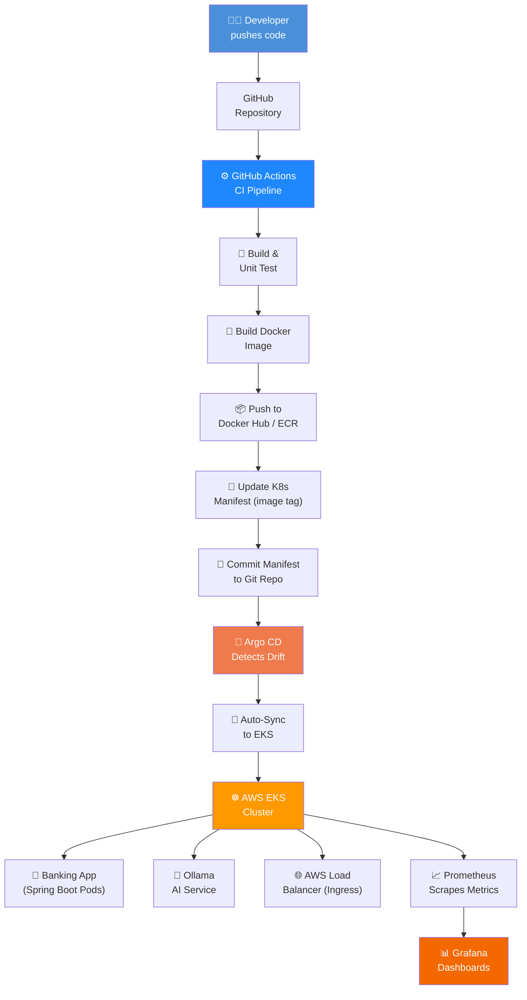
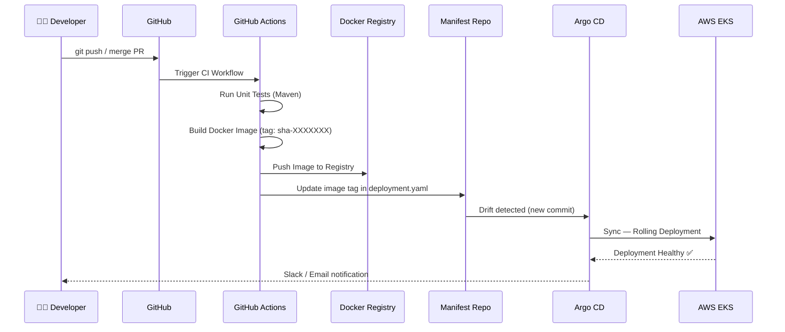

<div align="center">

# 🏦 AI-Powered Banking App — GitOps on AWS EKS

### Production-Grade DevOps | GitOps | Cloud-Native | CI/CD

[](https://github.com/yourusername/ai-banking-gitops/actions)
[](https://argoproj.github.io/cd/)
[](https://aws.amazon.com/eks/)
[](https://www.terraform.io/)
[](https://kubernetes.io/)
[](https://spring.io/projects/spring-boot)
[](https://www.docker.com/)
[](https://prometheus.io/)
[](https://grafana.com/)
[](https://ollama.com/)
[](https://opensource.org/licenses/MIT)

<br/>

> **A fully automated, production-grade GitOps pipeline deploying an AI-powered banking application on AWS EKS — showcasing end-to-end DevOps engineering: Infrastructure as Code, containerization, CI/CD automation, GitOps delivery, and real-time observability.**

<br/>

[🚀 Architecture](#-system-architecture) · [⚙️ CI/CD Pipeline](#️-cicd-pipeline) · [🛠️ Tech Stack](#️-tech-stack) · [📁 Project Structure](#-project-structure) · [🚢 Deployment](#-deployment-guide) · [📊 Monitoring](#-monitoring--observability) · [📚 Learnings](#-key-learnings)

</div>

---

## 📌 Project Overview

This project is a **DevOps and Cloud Engineering showcase** built around an AI-powered banking application. While the original Spring Boot banking application concept served as the base, **the entire DevOps lifecycle was designed and implemented from scratch** — covering containerization, cloud provisioning, Kubernetes orchestration, GitOps-driven continuous delivery, and full-stack observability.

> 💡 **Core Focus:** The primary value of this project lies in its **infrastructure, automation, and operational excellence** — not the application logic.

### What Makes This Project Stand Out

| Area | Implementation |
|---|---|
| **Infrastructure as Code** | 100% Terraform-provisioned AWS infrastructure — zero manual cloud console clicks |
| **GitOps Delivery** | Argo CD watches the Git repo; every merge to `main` triggers an automated EKS deployment |
| **CI Automation** | GitHub Actions builds, tests, and pushes Docker images with semantic versioning |
| **Observability** | Prometheus scrapes live Kubernetes metrics; Grafana dashboards surface cluster health |
| **AI Integration** | Ollama LLM runs as a sidecar-style service, handling natural language banking queries |
| **Production Patterns** | Namespace isolation, resource limits, liveness/readiness probes, rolling updates |

---

## 🏗️ System Architecture

```
┌─────────────────────────────────────────────────────────────────────┐
│                          DEVELOPER WORKFLOW                         │
│                                                                     │
│   git push  ──►  GitHub Actions CI  ──►  Docker Hub / ECR          │
│                        │                        │                  │
│                  (Build + Test)          (Image Tagged)             │
│                        │                        │                  │
│                  Updates K8s Manifests           │                  │
│                        │                        │                  │
│                        ▼                        │                  │
│                   Git Repo (Manifests)           │                  │
│                        │                        │                  │
└────────────────────────┼────────────────────────┼──────────────────┘
                         │                        │
                         ▼                        ▼
┌─────────────────────────────────────────────────────────────────────┐
│                         AWS CLOUD (EKS)                             │
│                                                                     │
│   ┌─────────────┐     ┌─────────────────────────────────────────┐  │
│   │   Argo CD   │────►│             EKS Cluster                 │  │
│   │  (GitOps)   │     │  ┌──────────────────────────────────┐  │  │
│   └─────────────┘     │  │          banking-app NS           │  │  │
│                        │  │  ┌────────────┐  ┌────────────┐  │  │  │
│   ┌─────────────┐     │  │  │  Spring    │  │   Ollama   │  │  │  │
│   │ Prometheus  │────►│  │  │  Boot Pod  │  │   AI Pod   │  │  │  │
│   │  + Grafana  │     │  │  └────────────┘  └────────────┘  │  │  │
│   └─────────────┘     │  └──────────────────────────────────┘  │  │
│                        │                                         │  │
│   ┌─────────────┐     │  ┌──────────────────────────────────┐  │  │
│   │  Terraform  │────►│  │    AWS Load Balancer (Ingress)   │  │  │
│   │    (IaC)    │     │  └──────────────────────────────────┘  │  │
│   └─────────────┘     └─────────────────────────────────────────┘  │
│                                                                     │
└─────────────────────────────────────────────────────────────────────┘
```

### GitOps Flow — Mermaid Diagram



---

## 🛠️ Tech Stack

<table>
  <thead>
    <tr>
      <th>Layer</th>
      <th>Technology</th>
      <th>Purpose</th>
    </tr>
  </thead>
  <tbody>
    <tr>
      <td><b>Application</b></td>
      <td>Java 17 + Spring Boot 3</td>
      <td>RESTful banking backend, business logic</td>
    </tr>
    <tr>
      <td><b>AI / LLM</b></td>
      <td>Ollama</td>
      <td>Local LLM inference for AI-powered banking queries</td>
    </tr>
    <tr>
      <td><b>Containerization</b></td>
      <td>Docker + Docker Compose</td>
      <td>Reproducible, portable application packaging</td>
    </tr>
    <tr>
      <td><b>Container Orchestration</b></td>
      <td>Kubernetes (K8s)</td>
      <td>Workload scheduling, scaling, self-healing</td>
    </tr>
    <tr>
      <td><b>Cloud Platform</b></td>
      <td>AWS EKS</td>
      <td>Managed Kubernetes control plane on AWS</td>
    </tr>
    <tr>
      <td><b>Infrastructure as Code</b></td>
      <td>Terraform</td>
      <td>Declarative AWS resource provisioning (VPC, EKS, IAM, etc.)</td>
    </tr>
    <tr>
      <td><b>CI Pipeline</b></td>
      <td>GitHub Actions</td>
      <td>Automated build, test, image push, manifest update</td>
    </tr>
    <tr>
      <td><b>CD / GitOps</b></td>
      <td>Argo CD</td>
      <td>Declarative, Git-driven continuous delivery to EKS</td>
    </tr>
    <tr>
      <td><b>Metrics Collection</b></td>
      <td>Prometheus</td>
      <td>Kubernetes & app-level metrics scraping</td>
    </tr>
    <tr>
      <td><b>Visualization</b></td>
      <td>Grafana</td>
      <td>Real-time dashboards, alerting, SLO tracking</td>
    </tr>
    <tr>
      <td><b>Image Registry</b></td>
      <td>Docker Hub / AWS ECR</td>
      <td>Versioned container image storage</td>
    </tr>
    <tr>
      <td><b>VCS</b></td>
      <td>GitHub</td>
      <td>Source of truth for both app code and K8s manifests</td>
    </tr>
  </tbody>
</table>

---

## 📁 Project Structure

```
ai-banking-gitops/
│
├── 📁 app/                          # Spring Boot Application
│   ├── src/
│   │   ├── main/java/com/banking/
│   │   │   ├── controller/          # REST API endpoints
│   │   │   ├── service/             # Business logic + Ollama AI service
│   │   │   ├── model/               # Domain models
│   │   │   └── config/              # App & AI configuration
│   │   └── resources/
│   │       └── application.yml
│   ├── Dockerfile                   # Multi-stage Docker build
│   └── pom.xml
│
├── 📁 terraform/                    # Infrastructure as Code
│   ├── main.tf                      # Root module — EKS, VPC, IAM
│   ├── variables.tf                 # Input variables
│   ├── outputs.tf                   # Cluster outputs (endpoint, kubeconfig)
│   ├── vpc.tf                       # VPC, subnets, route tables
│   ├── eks.tf                       # EKS cluster + managed node groups
│   └── iam.tf                       # IRSA roles, node instance profiles
│
├── 📁 k8s/                          # Kubernetes Manifests (GitOps source of truth)
│   ├── namespace.yaml
│   ├── deployment.yaml              # App deployment with probes & resource limits
│   ├── service.yaml                 # ClusterIP / LoadBalancer service
│   ├── ingress.yaml                 # AWS ALB Ingress
│   ├── configmap.yaml
│   ├── hpa.yaml                     # Horizontal Pod Autoscaler
│   └── ollama/
│       ├── deployment.yaml          # Ollama AI service deployment
│       └── service.yaml
│
├── 📁 argocd/                       # Argo CD Application manifests
│   └── application.yaml             # Argo CD App-of-Apps config
│
├── 📁 monitoring/                   # Observability stack
│   ├── prometheus/
│   │   ├── values.yaml              # kube-prometheus-stack Helm values
│   │   └── alerting-rules.yaml
│   └── grafana/
│       └── dashboards/
│           ├── kubernetes-cluster.json
│           └── banking-app.json
│
├── 📁 .github/
│   └── workflows/
│       ├── ci.yml                   # CI: Build → Test → Push → Update manifest
│       └── terraform-plan.yml       # Terraform plan on PR
│
├── docker-compose.yml               # Local development environment
└── README.md
```

---

## ⚙️ CI/CD Pipeline

The project implements a **fully automated GitOps delivery pipeline** with a clear separation of concerns between CI (GitHub Actions) and CD (Argo CD).

### Pipeline Overview



### GitHub Actions — CI Workflow (`.github/workflows/ci.yml`)

```yaml
name: CI Pipeline

on:
  push:
    branches: [ main ]
  pull_request:
    branches: [ main ]

jobs:
  build-and-push:
    runs-on: ubuntu-latest

    steps:
      - name: Checkout Code
        uses: actions/checkout@v4

      - name: Set up JDK 17
        uses: actions/setup-java@v4
        with:
          java-version: '17'
          distribution: 'temurin'

      - name: Run Unit Tests
        run: mvn test -f app/pom.xml

      - name: Build Application JAR
        run: mvn package -DskipTests -f app/pom.xml

      - name: Build Docker Image
        run: |
          docker build -t ${{ secrets.DOCKER_USERNAME }}/ai-banking-app:${{ github.sha }} ./app

      - name: Push to Docker Hub
        run: |
          echo "${{ secrets.DOCKER_PASSWORD }}" | docker login -u "${{ secrets.DOCKER_USERNAME }}" --password-stdin
          docker push ${{ secrets.DOCKER_USERNAME }}/ai-banking-app:${{ github.sha }}

      - name: Update K8s Manifest Image Tag
        run: |
          sed -i "s|image: .*/ai-banking-app:.*|image: ${{ secrets.DOCKER_USERNAME }}/ai-banking-app:${{ github.sha }}|" \
          k8s/deployment.yaml

      - name: Commit Updated Manifest
        run: |
          git config user.name "github-actions[bot]"
          git config user.email "github-actions[bot]@users.noreply.github.com"
          git add k8s/deployment.yaml
          git commit -m "ci: update image tag to ${{ github.sha }}"
          git push
```

### Argo CD — GitOps Sync (`argocd/application.yaml`)

```yaml
apiVersion: argoproj.io/v1alpha1
kind: Application
metadata:
  name: ai-banking-app
  namespace: argocd
spec:
  project: default
  source:
    repoURL: https://github.com/yourusername/ai-banking-gitops
    targetRevision: main
    path: k8s
  destination:
    server: https://kubernetes.default.svc
    namespace: banking-app
  syncPolicy:
    automated:
      prune: true
      selfHeal: true
    syncOptions:
      - CreateNamespace=true
```

> ✅ `selfHeal: true` ensures Argo CD automatically corrects any manual drift from the desired state — **Git is always the single source of truth.**

---

## 🚀 Deployment Guide

### Prerequisites

| Tool | Version |
|---|---|
| AWS CLI | v2+ |
| Terraform | v1.6+ |
| kubectl | v1.28+ |
| Helm | v3.12+ |
| Docker | v24+ |

### Step 1 — Clone the Repository

```bash
git clone https://github.com/yourusername/ai-banking-gitops.git
cd ai-banking-gitops
```

### Step 2 — Provision AWS Infrastructure with Terraform

```bash
cd terraform

# Initialize Terraform
terraform init

# Preview the execution plan
terraform plan -var="region=us-east-1" -var="cluster_name=banking-eks"

# Apply infrastructure
terraform apply -auto-approve
```

This provisions:
- ✅ VPC with public/private subnets across 2 AZs
- ✅ EKS Cluster with managed node groups
- ✅ IAM roles (IRSA) for service accounts
- ✅ AWS Load Balancer Controller prerequisites

### Step 3 — Configure kubectl

```bash
aws eks update-kubeconfig \
  --name banking-eks \
  --region us-east-1

# Verify cluster access
kubectl get nodes
```

### Step 4 — Install Argo CD on EKS

```bash
kubectl create namespace argocd

kubectl apply -n argocd \
  -f https://raw.githubusercontent.com/argoproj/argo-cd/stable/manifests/install.yaml

# Expose Argo CD UI
kubectl patch svc argocd-server -n argocd \
  -p '{"spec": {"type": "LoadBalancer"}}'

# Retrieve initial admin password
kubectl get secret argocd-initial-admin-secret -n argocd \
  -o jsonpath="{.data.password}" | base64 -d && echo
```

### Step 5 — Register the Application with Argo CD

```bash
kubectl apply -f argocd/application.yaml
```

Argo CD will immediately detect the `k8s/` manifests and sync the application to EKS. From this point forward, **every `git push` to `main` triggers an automatic deployment**.

### Step 6 — Deploy Monitoring Stack

```bash
# Add Helm repos
helm repo add prometheus-community https://prometheus-community.github.io/helm-charts
helm repo update

# Install kube-prometheus-stack (Prometheus + Grafana)
helm install monitoring prometheus-community/kube-prometheus-stack \
  --namespace monitoring \
  --create-namespace \
  --values monitoring/prometheus/values.yaml
```

### Step 7 — Access the Services

```bash
# Banking App
kubectl get svc -n banking-app

# Argo CD UI
kubectl get svc argocd-server -n argocd

# Grafana UI
kubectl get svc -n monitoring
# Default credentials: admin / prom-operator
```

---

## 📊 Monitoring & Observability

The observability stack is built on the **kube-prometheus-stack**, providing full visibility into cluster health and application performance.

### Metrics Collected

| Category | Metrics |
|---|---|
| **Cluster** | Node CPU/Memory utilization, pod restarts, network I/O |
| **Application** | JVM heap, HTTP request rate, response times, error rates |
| **Kubernetes** | Deployment replica status, HPA scaling events |
| **Ollama AI** | Model inference latency, request queue depth |

### Grafana Dashboards

```
📊 Kubernetes Cluster Overview
   ├── Node resource utilization
   ├── Namespace-level CPU/Memory breakdown
   └── Pod status and restart counts

📊 Banking Application Dashboard
   ├── HTTP request throughput (req/s)
   ├── P50 / P95 / P99 response latencies
   ├── JVM metrics (heap, GC pause times)
   └── Active sessions & error rate

📊 AI Service Dashboard
   ├── Ollama inference requests per minute
   └── Model response latency distribution
```

### Sample Prometheus AlertRule

```yaml
groups:
  - name: banking-app-alerts
    rules:
      - alert: HighErrorRate
        expr: rate(http_server_requests_seconds_count{status=~"5.."}[5m]) > 0.05
        for: 2m
        labels:
          severity: critical
        annotations:
          summary: "High HTTP error rate on banking app"
          description: "Error rate exceeded 5% over the last 5 minutes."
```

---

## 🌍 Local Development

Run the full stack locally using Docker Compose:

```bash
# Start all services
docker-compose up -d

# Services available at:
# Banking App  → http://localhost:8080
# Ollama AI    → http://localhost:11434
# Prometheus   → http://localhost:9090
# Grafana      → http://localhost:3000
```

---

## 📚 Key Learnings

Working through this project end-to-end produced deep, hands-on understanding of:

- **GitOps Mental Model** — Treating Git as the single source of truth for infrastructure and application state enforces discipline, auditability, and rollback simplicity. Argo CD's drift detection is a game-changer for operational stability.

- **Kubernetes at Depth** — Moving beyond basic deployments to configure liveness/readiness probes, HPAs, resource requests/limits, and namespace RBAC revealed how much operational safety Kubernetes can provide when configured correctly.

- **Terraform State Management** — Managing remote state with S3 + DynamoDB locking taught the criticality of state isolation, especially when collaborating or managing multiple environments.

- **CI/CD Separation of Concerns** — Keeping CI (code quality, image building) and CD (deployment) as separate concerns makes pipelines more reliable, auditable, and independently scalable.

- **Observability-First Thinking** — Shipping without metrics is shipping blind. Building the Prometheus + Grafana stack early changed how I thought about deployments — visibility before velocity.

- **IaC Discipline** — Zero manual cloud console interactions enforced a reproducible, version-controlled infrastructure that can be torn down and rebuilt in minutes.

---

## 🔭 Future Improvements

- [ ] **Multi-environment GitOps** — Separate `dev` / `staging` / `prod` Argo CD ApplicationSets with promotion gates
- [ ] **Helm Chart Migration** — Convert raw K8s manifests to parameterized Helm charts for environment-specific overrides
- [ ] **Secrets Management** — Integrate AWS Secrets Manager or HashiCorp Vault via External Secrets Operator (ESO)
- [ ] **Service Mesh** — Add Istio or Linkerd for mTLS, advanced traffic shaping, and distributed tracing
- [ ] **Canary Deployments** — Implement progressive delivery using Argo Rollouts
- [ ] **SLO Alerting** — Define SLIs/SLOs and wire multi-window, multi-burn-rate alerts in Prometheus
- [ ] **Terraform Modules** — Refactor infrastructure into reusable, versioned modules published to Terraform Registry
- [ ] **Cost Optimization** — Integrate AWS Spot instances and Karpenter for node autoprovisioning
- [ ] **DORA Metrics** — Instrument deployment frequency, lead time, MTTR, and change failure rate

---

## 🤝 Attribution

The base banking application logic and Spring Boot codebase were adapted from an existing open-source project. All **DevOps, cloud infrastructure, CI/CD, GitOps, and observability implementation** — including Dockerization, Terraform, EKS provisioning, GitHub Actions pipelines, Argo CD configuration, and the full monitoring stack — were **designed, built, and documented independently** as part of this portfolio project.

---

## 👤 Author

<div align="center">

**Your Name**

*DevOps & Cloud Engineer*

[](https://linkedin.com/in/yourprofile)
[](https://github.com/yourusername)
[](https://yourportfolio.dev)

*Open to DevOps, Platform Engineering, and Cloud Infrastructure roles.*

</div>

---

## 📄 License

This project is licensed under the [MIT License](LICENSE).

---

<div align="center">

**⭐ If this project helped you learn or served as inspiration, please consider starring the repo!**

*Built with precision. Deployed with confidence. Monitored with clarity.*

</div>
